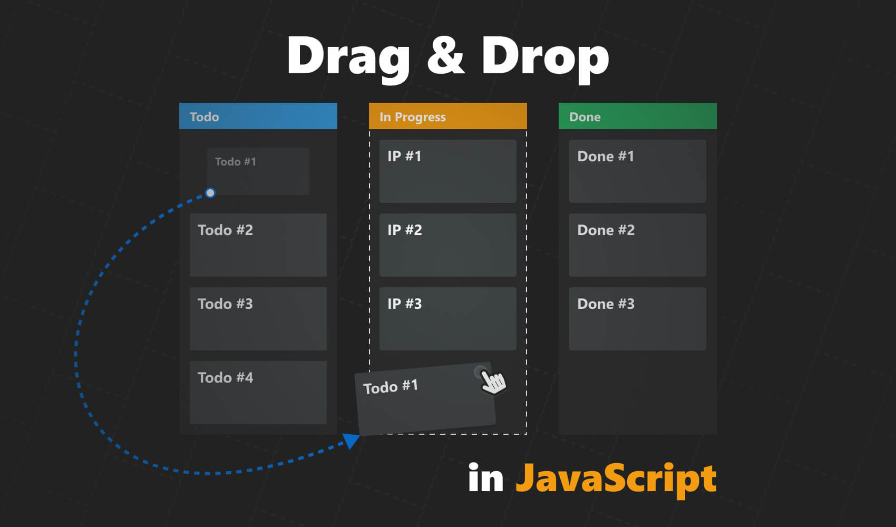

<h1 align="center">
    
</h1>
<h4 align="center">You can read the written tutorial about the implementation on <strong><a href="https://medium.com/javascript-in-plain-english/how-to-create-native-drag-and-drop-functionality-in-javascript-d7940a3f55da">Medium</a></strong> 📌</h4>

---

## 🐞 Bugfixes

**❓ Why is the scale effect doesn't work after the first drag?**
- This happens because the HTML of the column is updated. Since the event listeners are on the `.card`
  inside the `.column`, these will be detached from the DOM, after the first HTML update. This means they won't be triggered anymore, therefore they won't get the `.dragging` class which applies the scale effect. To fix this, all you have to do is delegate the event listener from the document.
  ```JavaScript
  document.addEventListener('dragstart', e => {
    if (e.target.className.includes('card')) {
      dragStart(e.target);
    }
  });
  ```